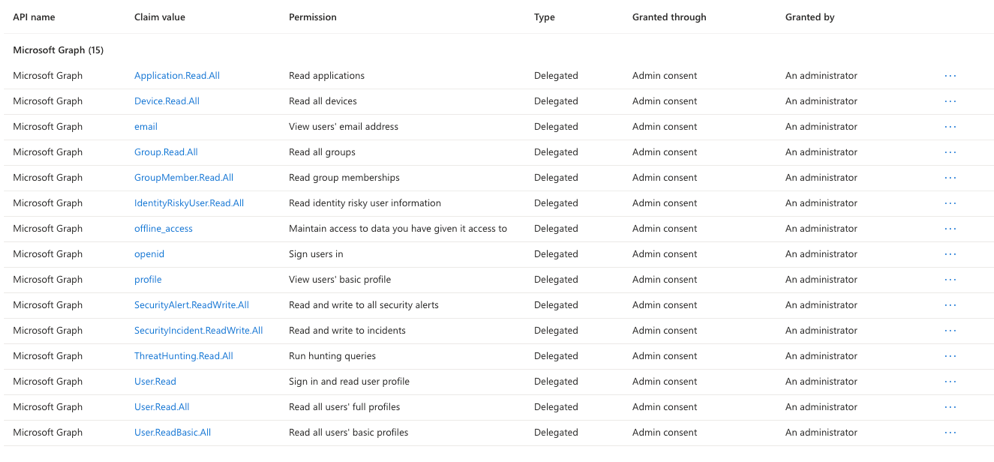
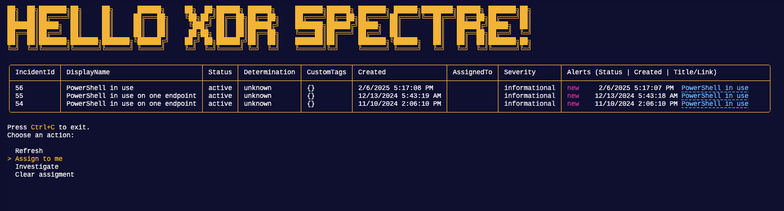

# PwshXDRSpectre

TUI for Defender XDR using PwshSpectreConsole because it is fun!

## Prerequisites

### Entra ID app registration

Delegated permissions preferable, because that way you don't need any secrets or certificates:



These might seem too much, but they enable adding further actions without needing to change the permissions.

> Any action taken by you - while using delegated permissions - will be tied to your account in the audit logs. 

### Modules

```PowerShell
#Requires -Version 7 -Modules PwshSpectreConsole, Microsoft.Graph.Authentication, Microsoft.Graph.Security
```

## Usage

```PowerShell
./PwshXDRDashboard.ps1 -tenantId '867b6ce7-bde1-4b57-ad45-26c49b675e6c' -clientID '7580ada2-de37-4ed3-8222-d4743cba052e'
```

Giving you (the last blue column is clickable link):



## Inspired by

https://github.com/ShaunLawrie/PwshEc2Tools
