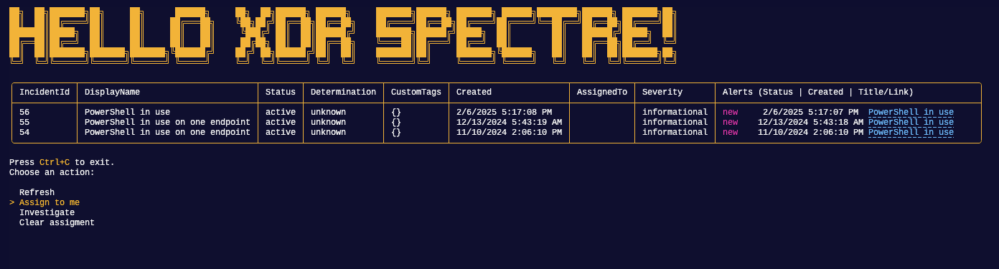

# PwshXDRSpectre

Terminal UI for Microsoft Defender XDR built with `PwshSpectreConsole`.

## Phase 1 architecture

The project now uses a module-first structure and shared runtime context:

- `PwshXDRSpectre.psm1`: module loader and public function exports.
- `Public/`: entry points and service functions.
- `Private/`: runtime context, operation wrappers, view-model converters, and helpers.
- `Tests/`: Pester tests for foundational contracts and wrapper wiring.

Current dashboard wrappers:

- `PwshXDRDashboard.ps1` -> `Start-PwshXdrDashboard`
- `Invoke-PwshXDRDashboard.ps1` -> `Start-PwshXdrLiveDashboard`

Both dashboard modes now share:

1. Session connection flow.
2. Incident and alert retrieval services.
3. Runtime context model.
4. Structured operation/error envelopes.

## Prerequisites

### Entra ID app registration

Delegated permissions are recommended, so no certificate or client secret is required.


Any action performed with delegated permissions will be associated with your user identity in audit logs.

### Required modules

```powershell
#Requires -Version 7 -Modules PwshSpectreConsole, Microsoft.Graph.Authentication, Microsoft.Graph.Security
```

## Usage

### Menu dashboard

```powershell
./PwshXDRDashboard.ps1 -tenantId '867b6ce7-bde1-4b57-ad45-26c49b675e6c' -clientID '7580ada2-de37-4ed3-8222-d4743cba052e' -limit 25
```

### Live dashboard

```powershell
./Invoke-PwshXDRDashboard.ps1 -tenantId '867b6ce7-bde1-4b57-ad45-26c49b675e6c' -clientID '7580ada2-de37-4ed3-8222-d4743cba052e' -limit 25
```

Optional authentication mode:

```powershell
./Invoke-PwshXDRDashboard.ps1 -tenantId '<tenant-guid>' -clientID '<app-client-id>' -UseDeviceCode
```

Example UI:



## Tests

Run baseline Phase 1 tests:

```powershell
Invoke-Pester -Path ./Tests -Output Detailed
```

## Inspired by

https://github.com/ShaunLawrie/PwshEc2Tools
