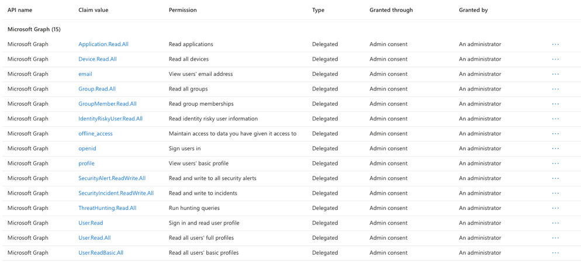
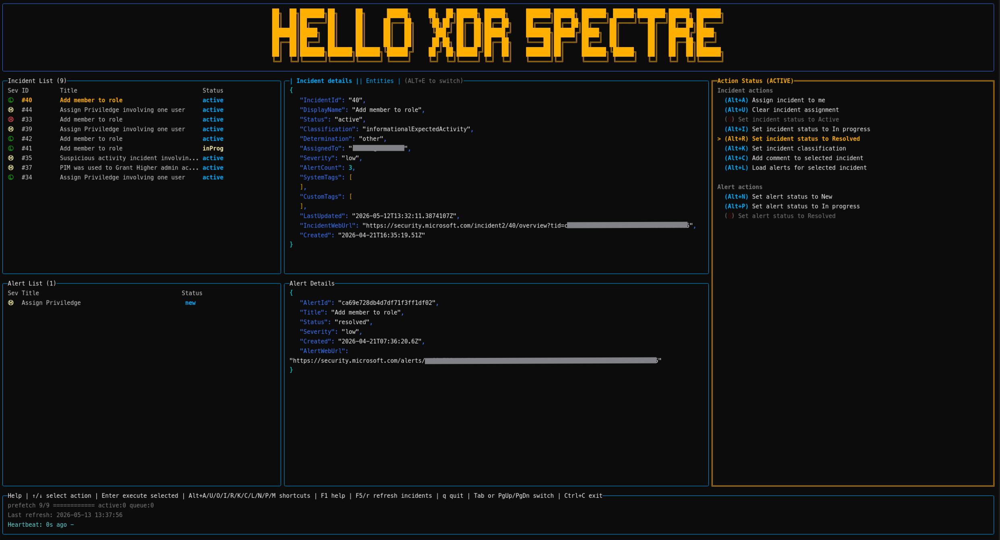

# PwshXDRSpectre

Terminal UI for Microsoft Defender XDR built with `PwshSpectreConsole`.

## Phase 1 architecture

The project now uses a module-first structure and shared runtime context:

- `PwshXDRSpectre.psm1`: module loader and public function exports.
- `Public/`: entry points and service functions.
- `Private/`: runtime context, operation wrappers, view-model converters, and helpers.
- `Tests/`: Pester tests for foundational contracts and wrapper wiring.

Current dashboard wrappers:

`Start-PwshXdrLiveDashboard`

Live dashboard mode uses:

1. Session connection flow.
2. Incident and alert retrieval services.
3. Runtime context model.
4. Structured operation/error envelopes.

## Prerequisites

### Entra ID app registration

Delegated permissions are recommended, so no certificate or client secret is required.



Any action performed with delegated permissions will be associated with your user identity in audit logs.

### Required modules

```powershell
#Requires -Version 7 -Modules PwshSpectreConsole, Microsoft.Graph.Authentication, Microsoft.Graph.Security
```

Quarantine review and actions use Defender for Office 365 quarantine cmdlets exposed by Exchange Online PowerShell. Install `ExchangeOnlineManagement` and connect before using quarantine commands:

```powershell
Install-Module ExchangeOnlineManagement -Scope CurrentUser
Connect-ExchangeOnline
```

## Usage

### Live dashboard

```powershell
Import-Module ./src/PwshXDRSpectre.psm1;
Start-PwshXdrLiveDashboard -TenantId '867b6ce7-bde1-4b57-ad45-26c49b675e6c' -ClientId '7580ada2-de37-4ed3-8222-d4743cba052e'
```

Optional authentication mode:

```powershell
Import-Module ./src/PwshXDRSpectre.psm1;
Start-PwshXdrLiveDashboard -TenantId '<tenant-guid>' -ClientId '<app-client-id>' -UseDeviceCode
```

Example UI:



### Quarantine review

Defender for Office 365 quarantine release/delete operations are not exposed through the Microsoft Graph Security incident and alert APIs used by the live dashboard. PwshXDRSpectre therefore uses the Exchange Online PowerShell quarantine cmdlets for this feature.

Phased delivery plan:

1. Phase 1: add quarantine retrieval plus release/delete service cmdlets through Exchange Online PowerShell.
2. Phase 2: wire the service cmdlets into a dedicated interactive dashboard panel.
3. Phase 3: add richer filters, bulk workflows, and audit export options.

Review quarantined messages:

```powershell
Import-Module ./src/PwshXDRSpectre.psm1
Connect-ExchangeOnline
Get-XdrQuarantineMessage -Limit 25 |
    Format-Table ReceivedTime, SenderAddress, RecipientAddress, Subject, QuarantineType, ReleaseStatus
```

Release or delete a quarantined message:

```powershell
Get-XdrQuarantineMessage -RecipientAddress analyst@example.com -Limit 1 |
    Invoke-XdrQuarantineAction -Action Release -ReleaseToAll -Confirm:$false

Invoke-XdrQuarantineAction -Identity '<quarantine-message-identity>' -Action Delete -Confirm:$false
```

## Tests

Run baseline Phase 1 tests:

```powershell
Invoke-Pester -Path ./src/Tests -Output Detailed
```

## Module Manifest

The module manifest is located at `src/PwshXDRSpectre.psd1`.

Validate it locally:

```powershell
Test-ModuleManifest -Path ./src/PwshXDRSpectre.psd1
```

## CI and Release Pipelines

GitHub Actions workflows:

- `.github/workflows/ci-quality-gates.yml`
	- Runs on PRs, `main`, and manual dispatch.
	- Validates module manifest.
	- Runs `PSScriptAnalyzer` with error-level gating.
	- Runs full `Invoke-Pester` test suite and uploads results.
- `.github/workflows/release-powershell-gallery.yml`
	- Runs on tags matching `v*` and manual dispatch.
	- Re-runs quality gates.
	- Validates that tag version matches manifest `ModuleVersion`.
	- Builds and uploads a distributable ZIP artifact.
	- Publishes to PowerShell Gallery when release conditions are met.
- `.github/workflows/release-github-artifact.yml`
	- Runs on tags matching `v*` and manual dispatch.
	- Re-runs quality gates.
	- Builds a versioned `.nupkg` artifact from the module source.
	- Creates (or updates) the GitHub Release and uploads the package asset.

## Security and SDLC

Security governance and secure delivery controls are defined in:

- `.github/SDLC-POLICY.md`
- `SECURITY.md`

Security automation workflows:

- `.github/workflows/codeql-code-scanning.yml` — GitHub CodeQL code scanning
- `.github/workflows/dependency-review.yml` — dependency risk gate on pull requests
- `.github/workflows/secret-scanning.yml` — secret detection via Gitleaks
- `.github/dependabot.yml` — automated GitHub Actions dependency updates

### Publishing to PowerShell Gallery

1. Configure repository secret `PSGALLERY_API_KEY`.
2. Bump `ModuleVersion` in `src/PwshXDRSpectre.psd1`.
3. Create and push a matching tag, for example `v0.1.0`.

Manual alternative:

```powershell
Publish-Module -Path ./src -Repository PSGallery -NuGetApiKey '<api-key>'
```

## Inspired by

https://github.com/ShaunLawrie/PwshEc2Tools
